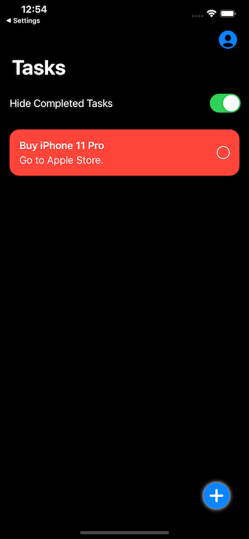
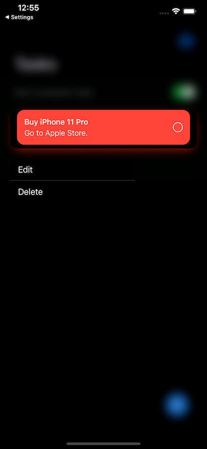

---

Simple Todo Application using **SwiftUI**/**Firebase**/**Redux**/**Combine**.

| Light                      | _                          | _                          | _                          |
| -------------------------- | -------------------------- | -------------------------- | -------------------------- |
|   |   |   |   |
|   |   |   | _                          |
| Dark                       | _                          | _                          | _                          |
|   |   |  |  |
|  |  |  |                            |

## Feature

- Use SwiftUI fully.
- Use Firebase.
  - Authentication
  - Cloud Firestore
- Adopt Redux Architecture.
- Compatible with DarkMode.
- Adopt Context Menu for edit/delete task.
- Support iPad(Full Screen).

